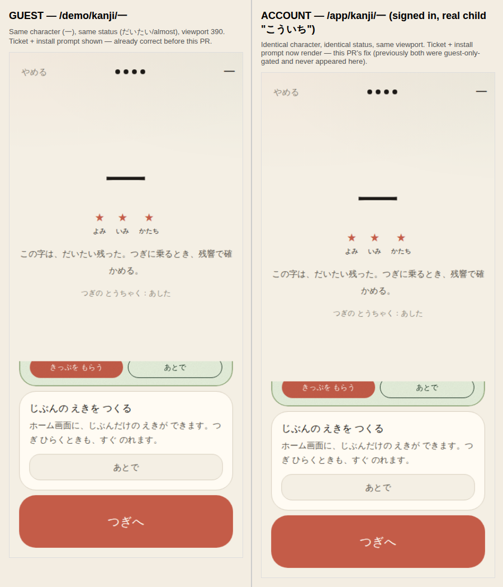
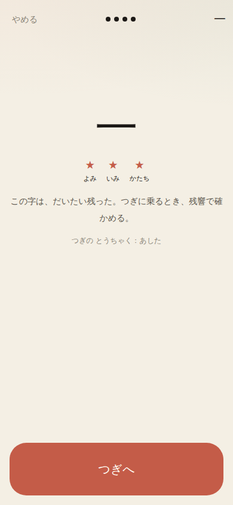
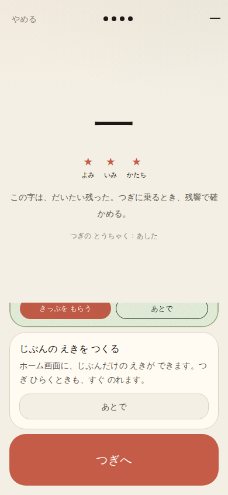

# R4 — ticket + install prompt on the account path

`docs/reviews/remediation-plan.md` R4. `kanji-session.tsx` gated `SessionStub` (the ticket),
`SavePromptBanner`, and `HomeScreenPrompt` (the install prompt) all on `hrefHome === "/demo"`.
An account child reaching だいたい got neither the return-ticket nor the install prompt that
protects its session from storage eviction — only the save prompt was correctly guest-only.

All captures are a real signed-in account (email/password sign-up, real child "こういち")
walked through an actual ride on 一 against a real local Postgres — encounter → understand
→ practice (reading/meaning/shape, answered correctly via the app's own
`data-tour="choice-correct"`/`stroke-next` markers) → arrival — not a fixture or a seeded
state.

- **URL base:** `http://127.0.0.1:8080` (local dev server, real `DATABASE_URL`)
- **Viewport:** 390×844. `ChildShell` (the ride's outer container) is `max-w-[900px]` on every
  viewport — this is a fixed-width card regardless of screen size, and the fix here is a
  boolean render condition, not layout, so a 1000px capture would show identical content with
  more surrounding background. Skipped rather than padded.
- **Commit:** pre-fix `kanji-session.tsx` reverted to `HEAD` (main, before this PR) for the
  "before" capture; this PR's branch for "after"

## Parity — same character, same status, one frame



Guest (`/demo/kanji/一`, left) already had this correctly. Account (`/app/kanji/一`, right,
real signed-in child) now matches exactly — same ticket, same printed return date, same
install prompt copy.

## Before / after on the account path specifically

| Before (account, real child, real だいたい arrival) | After (same account, same arrival) |
|---|---|
|  |  |

Before: よみ/いみ/かたち all starred, the relative arrival text renders, then straight to
「つぎへ」 — no ticket, no install prompt. The child has no return mechanism and the account
session has no storage-eviction protection.

## The ruling this preserves

`SavePromptBanner`'s render condition (`showSavePrompt`) is untouched by this PR — it still
requires `hrefHome === "/demo"`:

```ts
const showSavePrompt = savePromptVisible && hrefHome === "/demo" && progress.status === "almost";
const showInstallPrompt = installPromptVisible && progress.status === "almost";
const showTicket = ticketVisible && progress.status === "almost";
```

An account holder has already saved — the save prompt stays guest-only, unchanged. Only the
ticket and install prompt's `hrefHome` checks were removed, and the arming effect that flips
them on (first だいたい/perfect arrival, once per tab session) now fires for both paths
instead of only guest.
