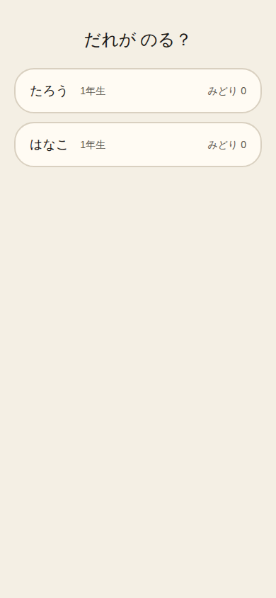
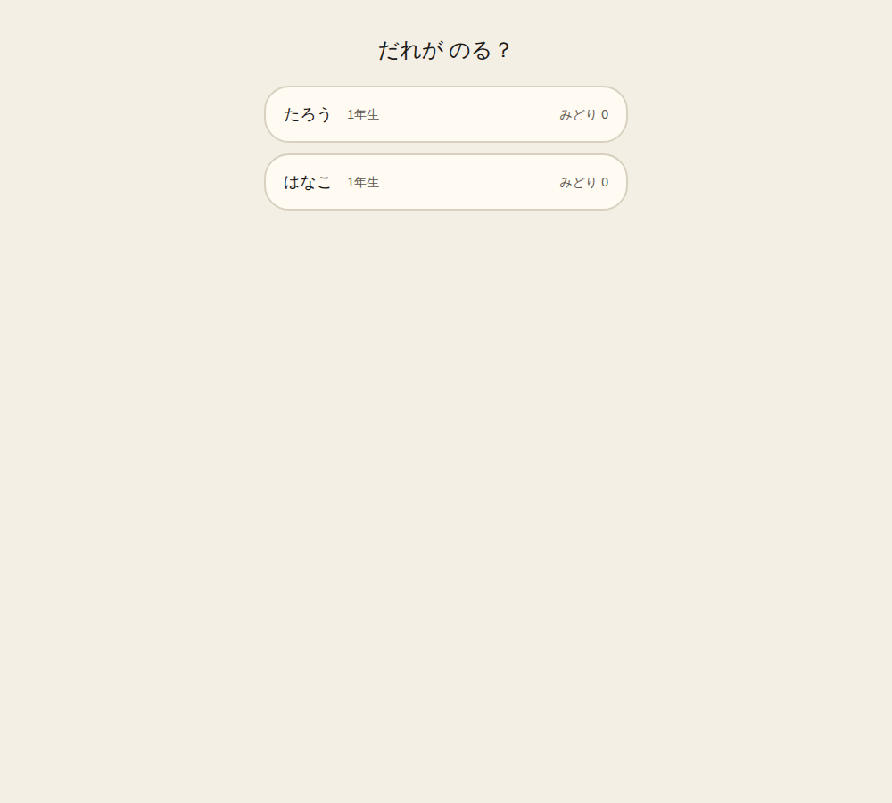
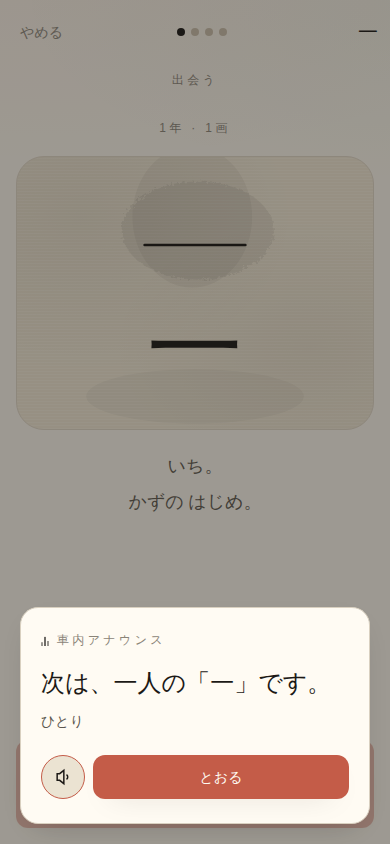
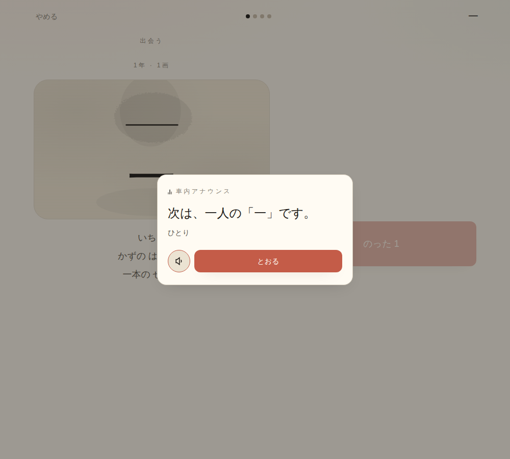
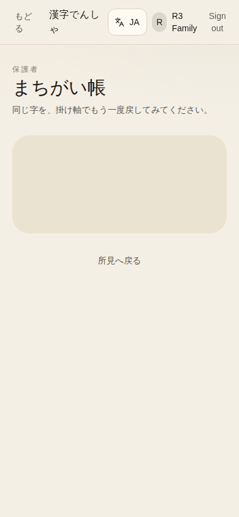
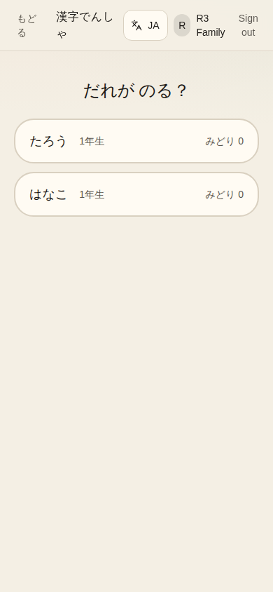
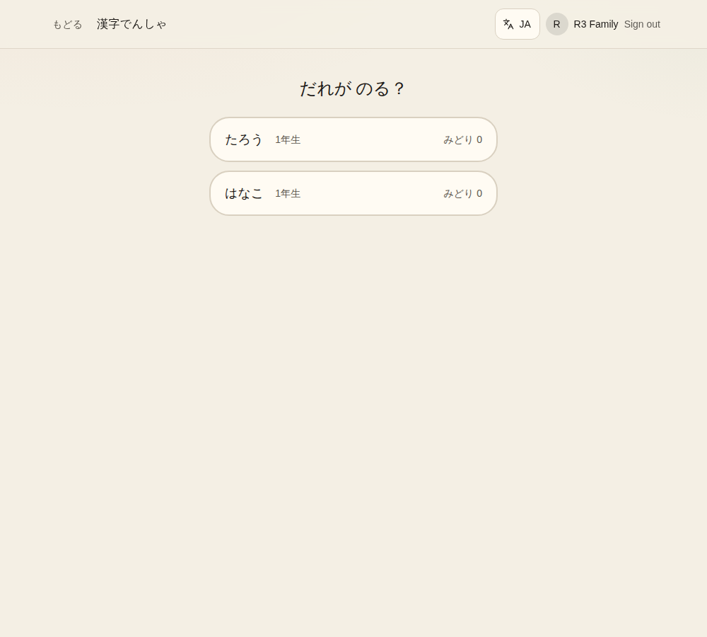
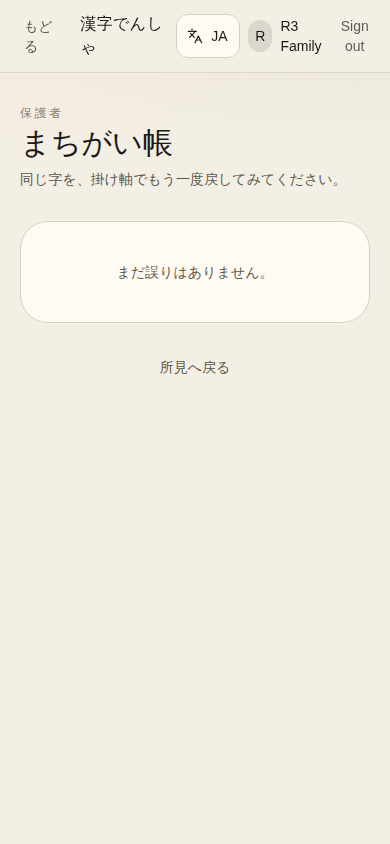
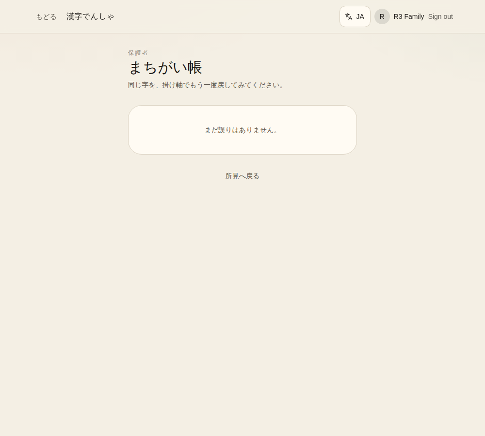

# R3 — StationBoard on /app/kanji and /app/mistakes

`docs/reviews/remediation-plan.md` R3. `kanji.$char.tsx` and `mistakes.tsx` both read
`readActiveChildId()` directly instead of `useActiveChild`, so a multi-profile household got
no picker: `/app/kanji/$char` rendered an infinite skeleton (no `childId`, so its own
`studyQ` never even runs), and `/app/mistakes` silently fell through to the empty-list
skeleton instead of asking which child.

All captures below are a real two-profile household — **たろう** and **はなこ**, both grade
1 — created through the actual sign-up + onboarding UI against a local Postgres, not
fixtures. Route-level, real running dev server, not a dev gallery.

- **URL base:** `http://127.0.0.1:8080` (local dev server, `pnpm --filter @kanji-densha/web
  dev`, `DATABASE_URL` pointed at a real local Postgres 16 so `listChildren`/`createChild`
  are the real server functions, not PGLite)
- **Auth state:** signed in, account with 2 children (multi-profile household)
- **Commit:** `b89a7b1` (main, before this PR's diff) for the "before" captures; this PR's
  branch for "after"
- **Viewports:** 390×844 and 1000×900 (protocol minimums)

## `/app/kanji/一` (fresh guest char, existing `?mode=play` param)

| Before | After — picker (390) | After — picker (1000) |
|---|---|---|
|  |  |  |

Before: nothing but an endless skeleton shimmer — `childId` never resolves because
`readActiveChildId()` returns `null` after the remembered child is cleared (the real
multi-profile case: two children exist, neither is "the" one). After: `StationBoard` asks
"だれが のる？" (who's riding?), listing both たろう and はなこ.

After selecting たろう, the route resolves correctly and renders the real ride:

| Selected (390) | Selected (1000) |
|---|---|
|  |  |

## `/app/mistakes`

| Before | After — picker (390) | After — picker (1000) |
|---|---|---|
|  |  |  |

Before: the page shell renders, but the mistakes list itself silently defaults to whatever
`readActiveChildId()` returns (`null` here) and shows an empty-list skeleton — no picker, no
indication a choice was even needed. After: the same `StationBoard` picker.

After selecting たろう:

| Selected (390) | Selected (1000) |
|---|---|
|  |  |

## The extended gate

`scripts/check-routing-invariants.mjs`'s new Gate 5 (any route calling `readActiveChildId()`
directly must also render `StationBoard`) fails on exactly these two files pre-fix and
passes after — see the R3 PR body for the pasted command output.
